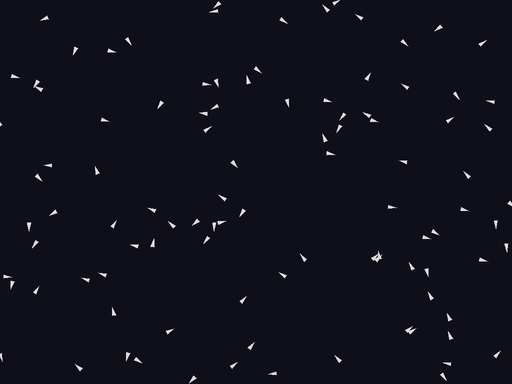

# Flocking

A flocking birds simulation using classic [boids](https://en.wikipedia.org/wiki/Boids) rules.



## Setup

```bash
uv sync
```

## Usage

```bash
flocking
```

| Control | Action |
|---------|--------|
| Left-click | Attract boids toward cursor |
| Right-click | Repel boids from cursor |
| Space / Middle-click | Spawn new boids at cursor |
| Up / Down arrows | Adjust speed |
| + / - | Adjust perception radius |
| P | Pause / resume |
| R | Reset flock |
| Escape | Quit |

## How It Works

Each bird follows three simple rules:

1. **Separation** — steer away from nearby neighbors to avoid crowding
2. **Alignment** — match the heading of nearby neighbors
3. **Cohesion** — steer toward the average position of nearby neighbors

These local rules produce emergent flocking behavior with no central coordination.
